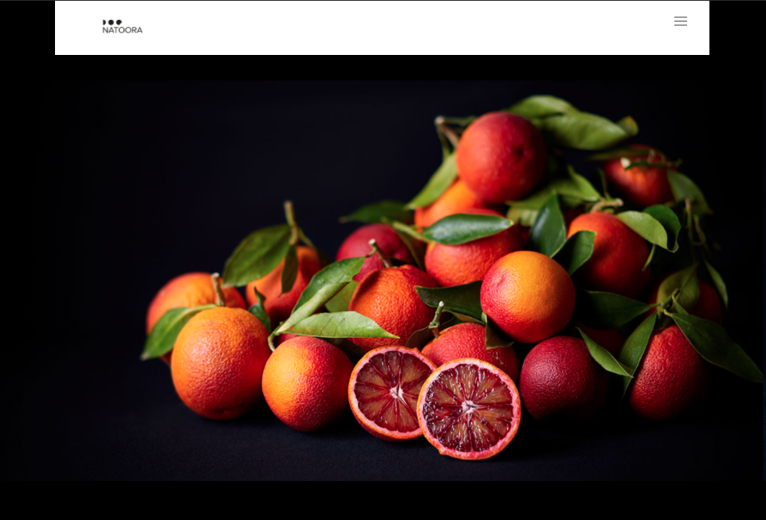
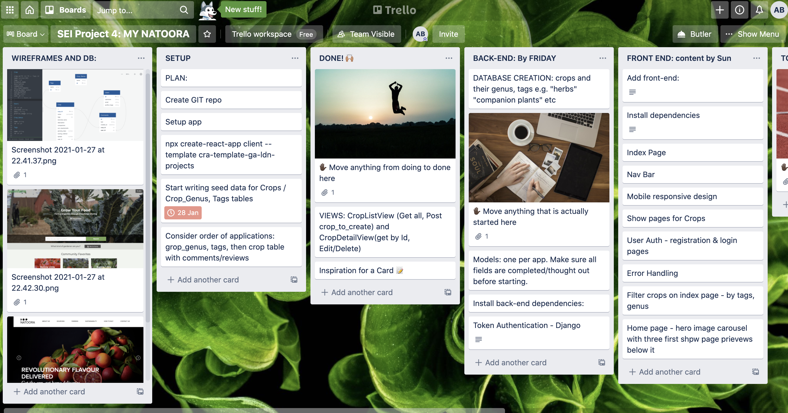
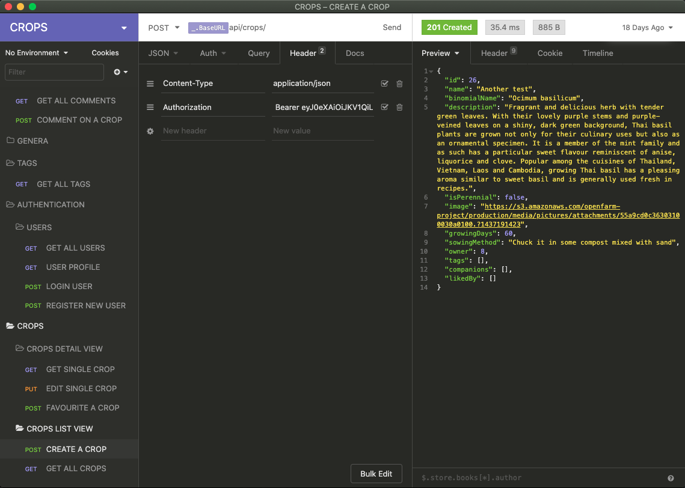
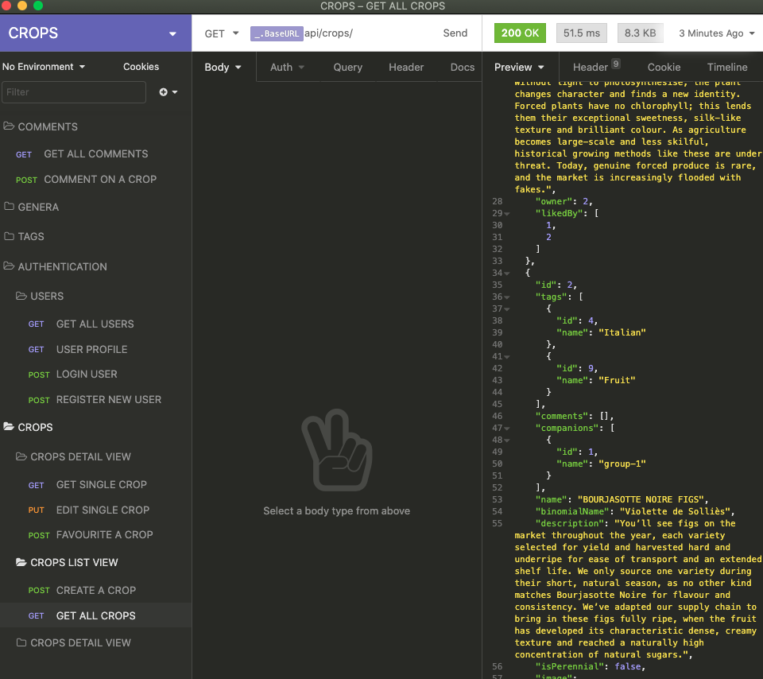

#  🍊*My Natoora *🍊

This was my final project for General Assembly’s Software Engineering Immersive course. Working solo, I had a week to develop a full-stack application using Python, Django & a PostgreSQL Database, with a separate front-end built with React. 



### Deployment

This website was deployed using Heroku and is available  [here](https://django-api-natoora-project.herokuapp.com) . 
Please allow a minute or two for the free servers to wake up..!

### Brief 

We were tasked with building a full-stack application of our choice, making our own back-end and front-end

**Requirements:** 
* **Use a Python Django API** – using Django REST Framework to serve your data from a Postgres database
* **Consume your API with a separate front-end** built with React
* **Be a complete product** - multiple relationships and CRUD functionality for a couple of models
* **Implement thoughtful wireframes** - that you designed before building the app
* **Have a visually impressive design**
* **Be deployed online** and accessible to the public

### Technologies We Used
* **Database**:
	*  PostgreSQL
	
* **Front-end**:
	* CSS3 + SASS
	* HTML5
	* JavaScript (ES6)
	* React.js
	
* **Back-end**:
	* Python
	* Django
	
* **Dependencies**:
	* Axios
	* Bulma
	* djangorestframework
	* djangorestframework-camel-case
	* JSONWebToken
	* jwt
	* python-dotenv
	* psycopg2-binary
	* react-hero-carousel
	* react-router-dom
	* react-select
	* react-spinners
	* yarn

* **Development Tools**:
	* Git + GitHub
	* Google Fonts
	* Heroku
	* Insomnia
	* pylint
	* QuickDBD
	* TablePlus
	* VS Code

### How To Install
1. Clone or download the repo from GitHub onto your machine.
2. Install back-end dependencies: `pipenv`
3. Enter the project shell: `pipenv shell`
4. Make migrations: `python manage.py makemigrations`
5. Migrate: `python manage.py migrate`
6. Load seed data for CropTags: `python manage.py loaddata crop_tags/seeds.json`
7. Load seed data for CompanionGroups: `python manage.py loaddata companion_groups/seeds.json`
8. Load seed data for Crops: `python manage.py loaddata crops/seeds.json`
9. Load seed data for Comments: `python manage.py loaddata comments/seeds.json`
10. Start the backend server in the root directory: `python manage.py runserver`
11. Open a second terminal to install dependencies in the client folder `cd client && yarn` or `cd client && npm`
12. Start the front-end:  `yarn start` 

### Concept
Born out of a (relatively) recently-discovered passion for growing vegetables, for my fourth project at GA I decided to build a gardening blog. I was inspired by the beautiful photographs on Natoora’s website -  and its ethos which builds focus on sustainable, local farming and highlights seasonal produce from trustworthy and transparent supply chains. I chose to recreate the general style and layout of this site but with the functionality of a community site. Users are able to therefore register/login, browse through all the crops people may be growing and leave comments on them discussing any tips and experiences they may’ve had. They can also create their own which will add to the main list.

### Wireframes
**Database Entity Relationship Diagram**


### Planning
 I began by drawing up an Entity Relationship Diagram (ERD) as above to work out the relationships I wanted to establish between the database tables. I decided to keep the Minimum Viable Product requirements simple - with users able to create and edit their profiles, create and delete crops to the index page, and create and delete their own comments  on the crops.  After MVP was reached, I would think about adding more functionality, but I really wanted to get comfortable with the Python models that we hadn’t had worked with for more than a week at this point. 

### Setup
I found Trello an invaluable resource while working solo, and was able to keep on top of each detail that would occur to me by adding a card to the project board. Giving myself short deadlines and a clear cut-off for MVP meant that I was able to keep myself accountable to stick to the plan, too:



### Back-End
The setting up of the back-end was relatively straightforward, involving: 
* Creating the PostgreSQL database using TablePlus
* Creating the seeds data for my index pages 
* Once the project had been set up, I went about creating my apps 

Crops Model code from crops/models.py: 
```
class Crop(models.Model):
    name = models.CharField(max_length=50)
    binomial_name = models.CharField(max_length=50)
    description = models.TextField(max_length=600)
    is_perennial = models.BooleanField(default=False)
    image = models.CharField(max_length=300)
    growing_days  = models.PositiveIntegerField()
    sowing_method = models.TextField(max_length=400)
    tags = models.ManyToManyField(
        'crop_tags.CropTag',
        related_name="crops",
        blank=True
    )
    companions = models.ManyToManyField(
        'companion_groups.CompanionGroup',
        related_name="crops",
        blank=True
    )
    liked_by = models.ManyToManyField(
        'jwt_auth.User',
        related_name="liked_crop",
        blank=True
    )
    owner = models.ForeignKey(
        'jwt_auth.User',
        related_name='created_crops',
        on_delete=models.CASCADE
    )

    def __str__(self):
        return f"{self.name} - {self.binomial_name}"

```

### Serializers:

PopulatedCropSerializer showing the one-to-many relationships:
```
class PopulatedCropSerializer(CropSerializer):
    """ Used for all outgoing serialization, includes populated Comments """

    tags = CropTagSerializer(many=True)
    comments = PopulatedCommentSerializer(many=True)
    companions = CompanionGroupSerializer(many=True)


```

### Views:
An example code block for viewing a specific crop by id:
```
class CropDetailView(APIView): # extend the APIView

    def get_crop(self, pk):
        ''' returns crop from db by its pk(id) or responds 404 not found '''
        try:
            return Crop.objects.get(pk=pk)
        except Crop.DoesNotExist:
            raise NotFound()
            

    def get(self, _request, pk):
        crop = self.get_crop(pk=pk) # get a crop by id
        serialized_crop = PopulatedCropSerializer(crop)
        return Response(serialized_crop.data, status=status.HTTP_200_OK)  # send the JSON to the client

```

### Insomnia 
I relied on this tool greatly in troubleshooting the above code and it helped see visually how the data was being stored, e.g. with user authorization when creating a new crop with POST request:


### Front-End
Adding the front-end to the project went relatively smoothly and I was quickly moving on to mapping through the crop in the show page to show tags and comments:

```
const handleSubmit = async (event) => {
    event.preventDefault()
    try {
      console.log(formdata)
      await createCropComment(formdata)
      const { data } = await getSingleCrop(id)
      setCrop(data)
      formdata.text = ''
      crop.id = ''
      console.log(formdata)
    } catch (err) {
      setErrors(err.response.data.errors)
    }
  }

```

It took a while to establish how exactly to get the crops tags “name” to display how I wanted - again I used Insomnia to help identify how this information was nested:
Insomnia crops “get request”:



### Wins
* **Styling**: it was important to me to focus on mobile-responsive design for this project, and I am pleased with the nav bar and index  & registration pages. I also think a likeness was achieved in the index page with the collage of photos and hover-links:
[**INDEX PAGE IMAGE TO BE ADDED**]
*  **Relationships** - I’m pleased that, although not all of them have been used in the front-end yet, the relationships between companion groups, crops and tags have all been established which will make adding to this project much simpler. 

### Challenges
* **Deployment**: bugs that I discovered only once delaying were challenging as they took a while to rectify, and establishing how to configure a database to run on a live server.
* Working solo at this stage was a great way to be able to work at my own pace but it also meant I lacked the second pairs of eyes and ears which I had become accustomed to - luckily the instructors were on hand when I needed to talk out loud about a challenge I was facing

### Key Learnings
* Deeper understanding of React
* Alternative full-stack application to MERN we had done previously

### Future Fixes & Additions
* Select boxes in index page
* Companion Planting section - this relationship is established in the backend but unfortunately I didn’t have enough time to add this feature to the front-end. The idea is that a user can create a “garden” of companion plants which provide complimentary growing conditions to one another through their proximity
* Add an e-commerce capability to the app so that users can buy and sell both seeds and also grown produce

### Want to contribute?
If you have suggestions for improving this project, please let me know on GitHub .

### License & copyright
This project was built for educational purposes - all info is fictional
